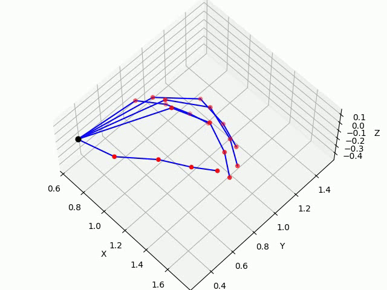
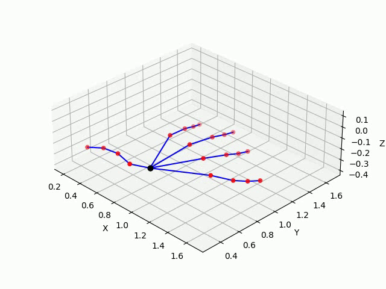
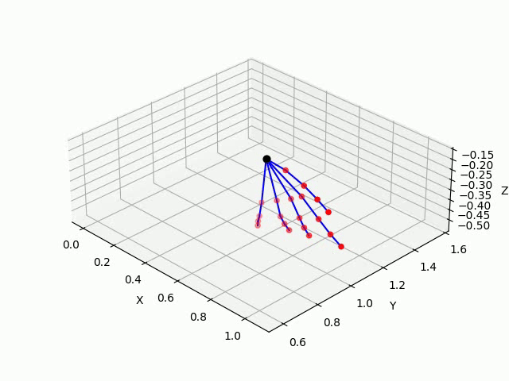
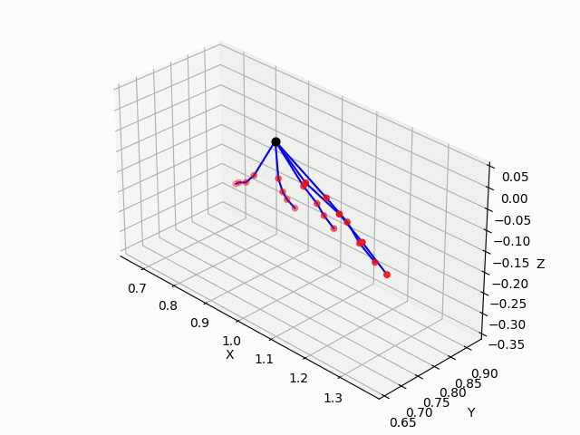
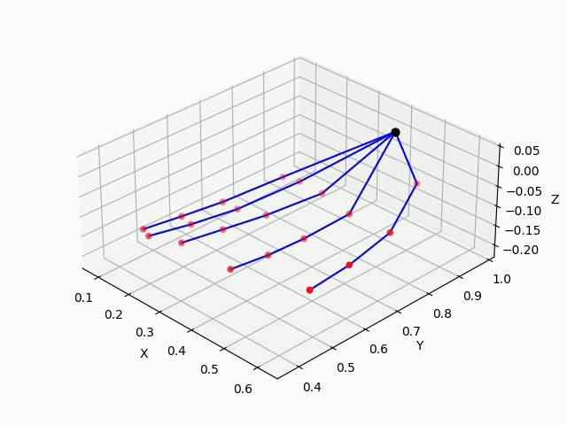
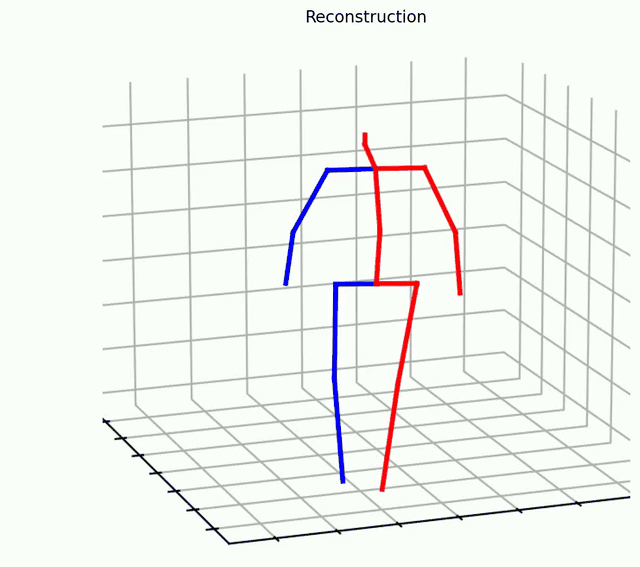
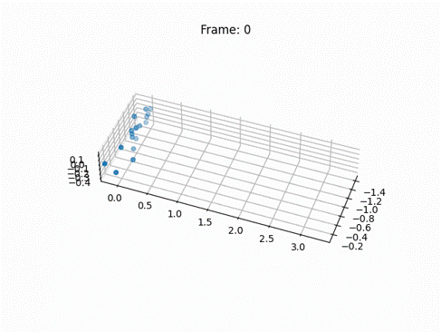
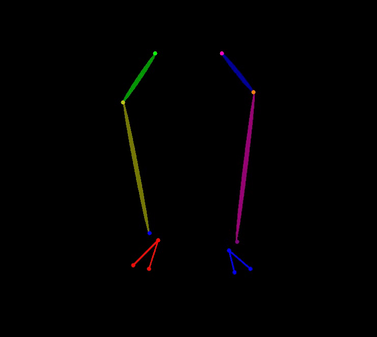
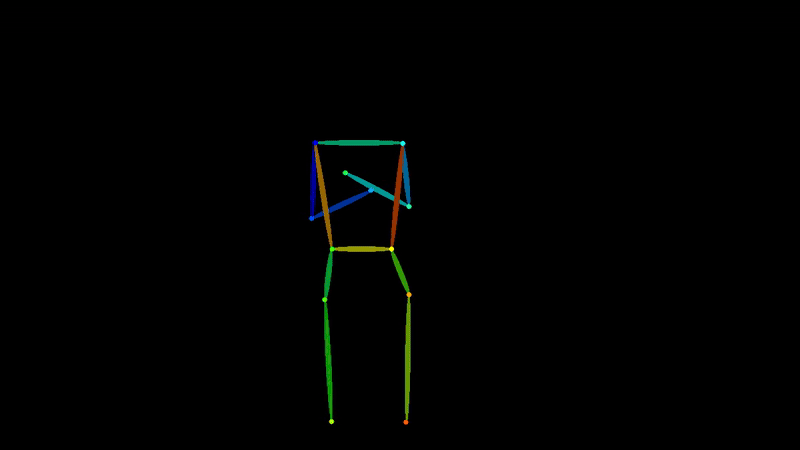
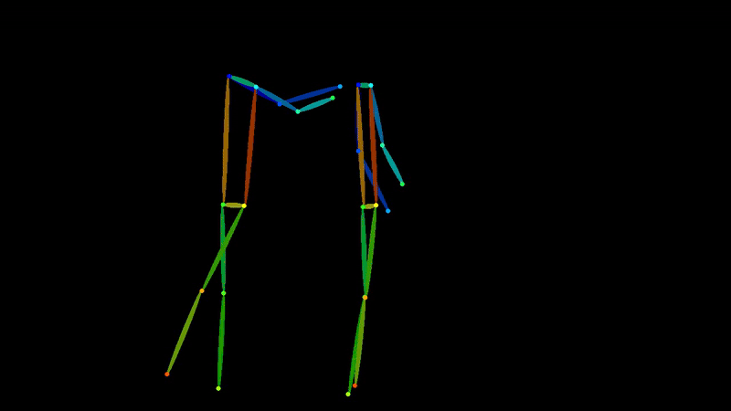

# ParkinsonNet
The code for "ParkinsonNet: Generalized Network for Estimating Parkinson's Disease Motor Symptom Severity" is coming.

<table>
  <tr>
    <td align="center">
       
      <b>Finger Tapping</b>
    </td>
    <td align="center">
       
      <b>Hand Movements</b>
    </td>
  </tr>
  <tr>
    <td align="center">
       
      <b>Pronation-Supination</b>
    </td>
    <td align="center">
       
      <b>Postural Tremor</b>
    </td>
      <td align="center">
       
      <b>Rest Tremor (hand)</b>
    </td>
  </tr>
</table>

<table>
  <tr>
    <td align="center">
       
      <b>Gait (Score 2)</b>
    <td align="center">
       
      <b>Gait (score 1)</b>
    <td align="center">
       
      <b>Gait (score 0)</b>
    </td>
  </tr>
</table>

<table>
  <tr>
    <td align="center">
       
      <b>Leg agility</b>
    <td align="center">
       
      <b>Arising from Chair</b>
    <td align="center">
       
      <b>Postural Stability</b>
    </td>
  </tr>
</table>

