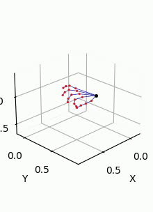
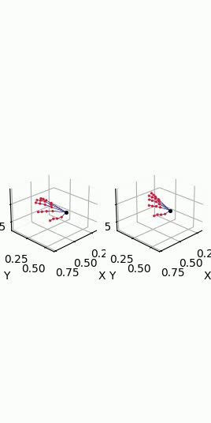
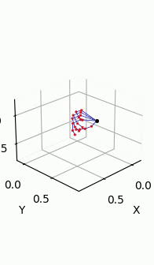
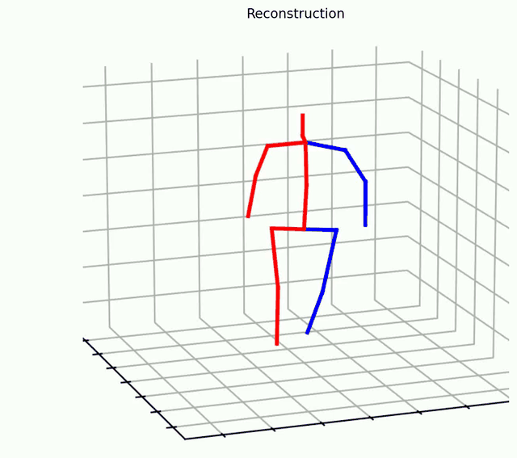

# ParkinsonNet
The code for "ParkinsonNet: Generalized Network for Estimating Parkinson's Disease Motor Symptom Severity" is coming.

The following examples are provided to offer an intuitive understanding of how skeleton information is leveraged to estimate the severity of motor symptoms in Parkinson’s disease (PD). This work primarily focuses on two representative tasks: Finger Tapping and Gait Analysis

**Finger Tapping**  
Videos are labeled with MDS-UPDRS severity scores ranging from:  
- **0** – Normal （No problems）
- **1** – Slight  （Any of the following: a) the regular rhythm is broken with one or two interruptions or hesitations of the tapping movement; b) slight slowing; c) the amplitude decrements near the end of the 10 taps.）
- **2** – Mild  （Any of the following: a) 3 to 5 interruptions during tapping; b) mild slowing; c) the amplitude decrements midway in the 10-tap sequence.）
- **3** – Moderate （Any of the following: a) more than 5 interruptions during tapping or at least one longer arrest (freeze) in ongoing movement; b) moderate slowing; c) the amplitude decrements starting after the 1st tap.）

<table>
    <td align="center">
       
      <b>Finger Tapping (Score 0)</b>
    </td>
    <td align="center">
       
      <b>Finger Tapping (Score 1)</b>
    </td>
      <td align="center">
       
      <b>Finger Tapping (Score 2)</b>
    </td>
      <td align="center">
       
      <b>Finger Tapping (Score 3)</b>
    </td>
  </tr>
</table>

**Gait Analysis**  
Videos are labeled with MDS-UPDRS Part III gait item scores (0–4):  
- **0** – Normal  （No problems.）
- **1** – Slight (Independent walking with minor gait impairment.)  
- **2** – Mild (Independent walking but with substantial gait impairment)

<table>
  <tr>
    <td align="center">
       
      <b>Gait (Score 0)</b>
    <td align="center">
       
      <b>Gait (score 1)</b>
    <td align="center">
       
      <b>Gait (score 2)</b>
    </td>
  </tr>
</table>
<table>
  <tr>
    <td align="center">
       
      <b>Gait from PDG3D (Score 0)</b>
  </tr>
</table>

